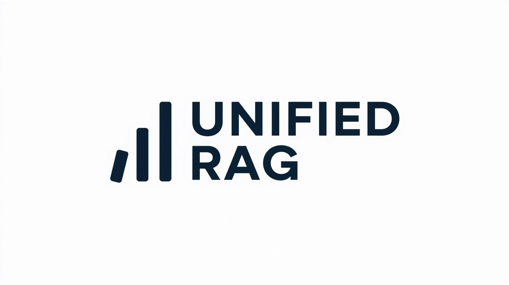
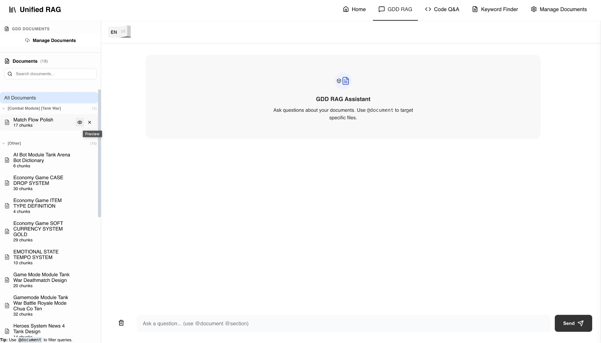
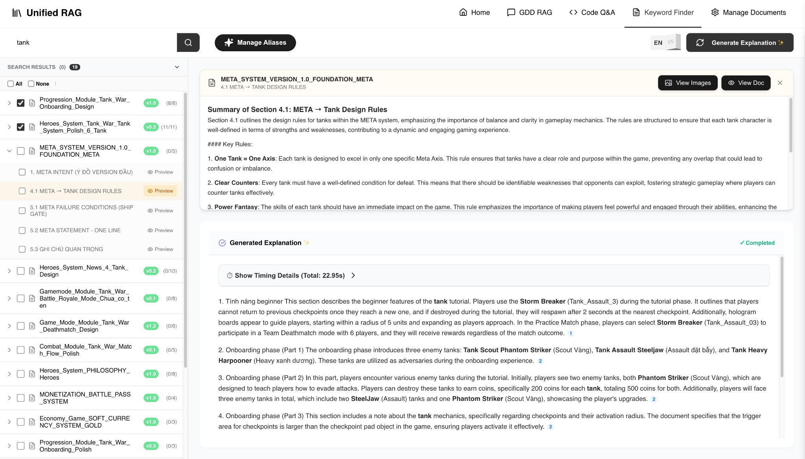

<p align="center">
  
</p>

# Unified RAG

A web app that combines **GDD RAG** (document Q&A), **Code Q&A**, and **Keyword Finder** in one place. Upload PDFs and code, search by keyword, and ask questions with AI-backed answers.

---

## Features

- **GDD RAG** – Upload PDFs, chat with your documents, get answers with citations.
- **Code Q&A** – Index C# files, ask questions about your codebase.
- **Keyword Finder** – Search by keyword, get translations and synonyms, generate explanations.
- **Manage Documents** – List, search, and delete indexed GDD documents and code files.

---

## Quick start

1. **Clone** the repo and go into the project folder.
2. **Python 3.11** is required. Create a virtualenv and install dependencies:

   ```bash
   python3.11 -m venv venv
   source venv/bin/activate   # Windows: venv\Scripts\activate
   pip install -r requirements.txt
   ```

3. **Supabase** – Create a project, run `supabase_deploy.sql` in the SQL Editor, and create a public storage bucket named `gdd_pdfs`.
4. **Environment** – Copy `.env.example` to `.env` and set your Supabase URL/keys and at least one LLM API key (OpenAI, Qwen/DashScope, or Ollama).
5. **Run** the app:

   ```bash
   python app.py
   ```

   Open **http://localhost:5000** in your browser.

---

## Useful links

| Link                                   | Description                                                     |
| -------------------------------------- | --------------------------------------------------------------- |
| [Setup guide](SETUP.md)                | Step-by-step setup: Supabase, bucket, env vars, troubleshooting |
| [Supabase schema](supabase_deploy.sql) | SQL to run in Supabase SQL Editor (tables, pgvector, indexes)   |
| [Environment template](.env.example)   | Copy to `.env` and fill in API keys and Supabase URL/key        |
| [Requirements](requirements.txt)       | Python dependencies                                             |

---

## Tech stack

- **Backend:** Flask, Python 3.11
- **Storage:** Supabase (Postgres, pgvector, Storage)
- **LLM / embeddings:** OpenAI-compatible API (OpenAI, Qwen/DashScope, or Ollama)

---

## Screenshots

**GDD RAG** – Document list and RAG assistant:

<p align="center">
  
</p>

**Keyword Finder** – Search by keyword, view sections, generate explanations:

<p align="center">
  
</p>

---

## License

See the repository for license information.
